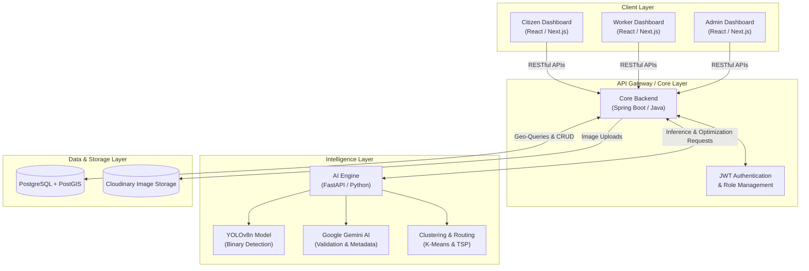
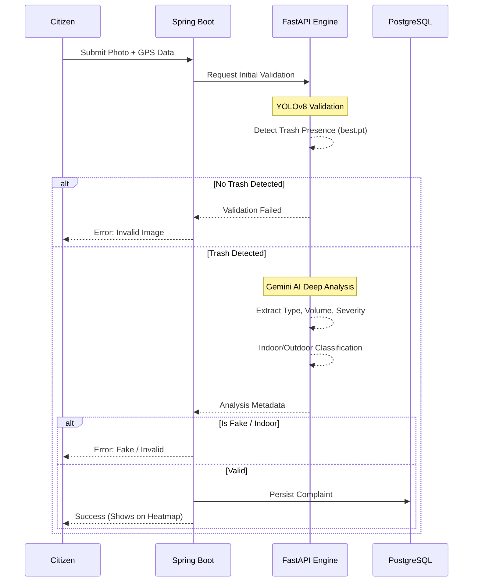
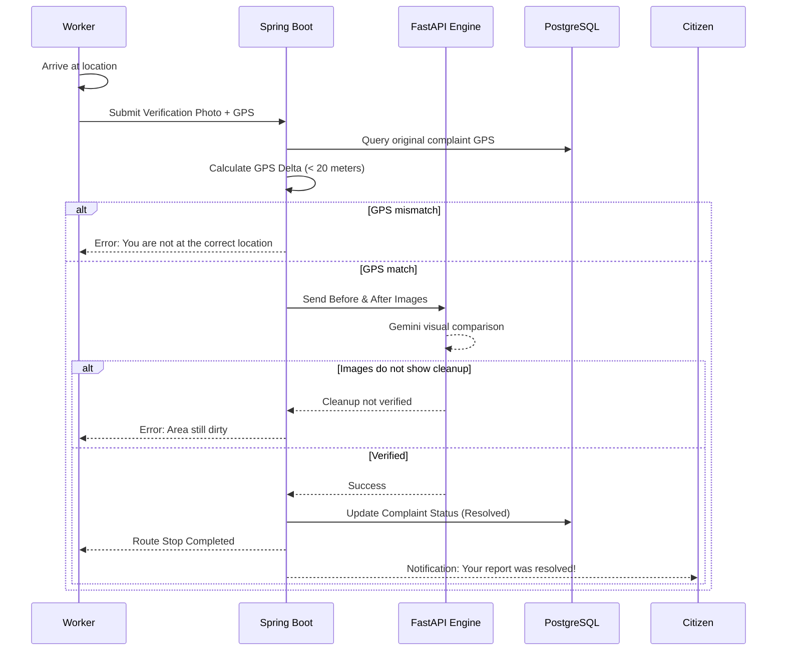

Imagine taking an evening walk through a public park, only to find the pathways littered with scattered trash. 

The immediate thought is usually frustration because it's unhygienic and ruins the environment. But let's say you're a responsible citizen who actually wants to do something about it. You decide to report it to the local municipality. 

That's when you hit a wall of practical problems:

- **Who do you call?**
-  **Will they answer your call?**
- **How will you explain the context and location?**
- **Will they actually come and clean it?** 

Even if you manage to report it, will you again go through this just for a pile of trash you observed?

These were the exact reasons why I built **Chokho AI**. 
In pahadi, *Chokho means pure/clean* and it exactly aligns with our goal - <u style="font-weight: 500;">to achieve a cleaner neighbourhood.</u>

> **Chokho AI** is a smart waste management and routing platform built for citizens to report trash and optimize the cleaning routes for municipal corporations.

## High Level Architecture

The backend is built on a polyglot microservice architecture, where Spring Boot is used for buisness logic and FastAPI is used for ML operations, AI Inference and route optimization. Next.js is used for the frontend. For the database, I used PostgreSQL with PostGIS extension for spatial queries.

## Detailed Explanation

### Phase 1 (Citizen Reporting & AI Validation)

When a user wants to report a trash, the system does the following operations:

1. Firstly before letting user upload any image, the system makes sure that a user is not uploading an old image or any malicious file on our system by only allowing the user to directly open the camera from our system and upload the clicked image.

2. When user hits the submit button, our system extracts the GPS coordinates from his browser and the image is uploaded. Then it goes through a finetuned **YOLOv8n** model to detect the location of trash.

3. If trash is detected, then the image goes to the AI layer and it does the following things :
    - checks if the image is clicked in indoors
    - checks if the image is fake
    - measure the severity score (*1.0 - 10.0*)
    - checks the type of trash (*PLASTIC, HAZARDOUS, DEBRIS, etc*)
    - estimates the volume of trash (*SMALL, MEDIUM, LARGE*)
    - analyses the context of the image
    - analyses the location of complaint

4. Once all conditions are met, the complaint is registered on the system, user gets notified and the complaint is publicly visible on the heatmap.

### Phase 2 (Optimized Dispatch & Verified Cleanup)

Once a lot of complaints get registered on the system, they also get reflected on the heatmap. After taking a look at the heatmap, the admin can manually trigger the system to optimize the routes for the municipality vehicles. 

1. To optimize the routes, the system intially divides all the current active complaints into **n clusters** by using **K-Means Clustering Algorithm**. The value of n can be manually set by the admin or by default it is the number of available vehicles.

2. Then for each cluster, the system implement **TSP (Travelling Salesman Problem)** on the data points and return a the optimized order of the points for that particular cluster.

3. After calculating the optimized routes for all clusters, each cluster is mapped to a particular vehicle and that vehicle is assigned to a worker.

Everyday when a worker comes to his job, he can see his today's active route on his personalized dashboard.

1. When a worker reaches a complaint location, he must send an after cleanup image of the same location to the system to verify the cleanup of that complaint.

2. After a worker submits a cleanup image, that image goes through the AI layer and it verifies the cleanup image with the original complaint image.

3. If the cleanup image is valid, the complaint's status is changed to *CLEANED*, heatmap gets updated and the user is notified of the cleanup with both complaint and cleanup image.

## The Big Picture

This is the complete architecture of how **Chokho AI** works! By combining the reliability of Spring Boot, the speed of FastAPI, and the intelligence of modern AI models, we can replace a broken, manual reporting system with an automated, optimized workflow.

**Want to see it in action?** Check out the [demo video of Chokho AI here](https://res.cloudinary.com/mannr075/video/upload/v1780721808/Choho_AI_for_Accountable_Waste_Management_2026-06-06T04-13-53-242Z_z5zuno.mp4).

### What's Next?
While the core architecture is solid, there is always room for improvement. My next goals for Chokho AI include:
- Building a dedicated mobile app for citizens and workers for better user experience.
- Expanding the AI model to recognize different classifications of waste (recyclable vs. non-recyclable) to optimize the type of truck dispatched.

### Let's Connect!

I'd love to hear your feedback on the architecture! Feel free to connect with me on [LinkedIn](https://www.linkedin.com/in/mann-rana29/) and let me know your thoughts.

If you are an investor, municipality representative, or developer interested in scaling this solution, I'd love to talk. Please reach out via [email](mailto:mannworks247@gmail.com) or send me a DM on [LinkedIn](https://www.linkedin.com/in/mann-rana29/).

